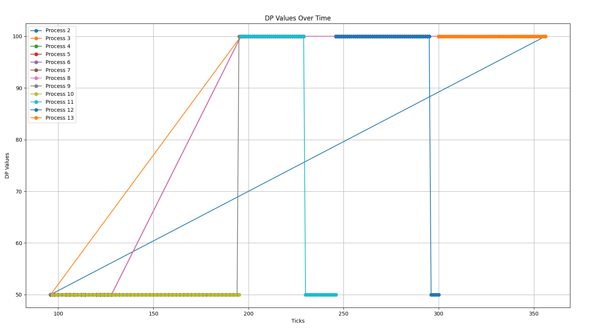

# Modified Priority Based Scheduler in xv-6

The scheduler is designed to select the process with the highest priority for execution, considering both Static Priority (SP) and Recent Behaviour Index (RBI).

In the `update time` function, `wtime` and `stime` are incremented depending on the state of the process.

RBI is calculated using the given formula, and the dynamic property is the minimum of 100 and the sum of static priority and RBI.

Since a smaller value will represent higher priority, the process with higher priority is scheduled first.

**Tie-Breaking:**

In case of ties, the number of times scheduled is considered (a variable has been added to keep track of this), then based on creation time. The process scheduled more number of times is given higher priority, and the process with less creation time is given priority.

**Static Priority:** Can be changed for a process using the `set_priority` system call, is adjusted manually  
**RBI:** calculated dynamically based on the `rtime`, `wtime`, `stime`

DP is calculated based on these two, the process with higher dynamic priority is taken first (a smaller value means higher priority).

The combination of manual prioritization (SP) and dynamic adjustments (RBI) ensures a responsive and balanced approach, contributing to an improved scheduling mechanism in the xv6 operating system.

## Concurrency

### Cafe Sim

1. **Waiting Time:**

   If the cafe had infinite baristas, then waiting time for each customer is 1 since immediately after a customer arrives, there will be a barista available to take up the order and start preparing after 1 second. Hence, the average wait time a customer spends waiting for their coffee is 1 second.

   Wait time without the infinite baristas is greater than the case where there are infinite baristas since wait time is obviously less in the case with infinite baristas.

   In the given example, the waiting times are 1 second, 1 second, and 5 seconds for customers 1, 2, 3, respectively. The average wait time is 2.33.

2. **Coffee Wastage:**

   The number of coffees wasted is the number of customers whose tolerance exceeds, and the barista already began preparing their order before their tolerance exceeded.

   In the given example, 1 coffee is wasted.

### Ice Cream Parlour Sim

1. **Minimizing Incomplete Orders:**

   Checking for topping quantity before accepting the order, so this way a partial order will not be prepared at all if the whole order cannot be completed.

   When a customer arrives, check for topping quantity and keep it reserved for that customer if it is a complete order so that the current customer will not go out of ingredients when another customer consumes these ingredients.

2. **Ingredient Replenishment:**

   When the quantity of a topping reaches 1, replenish it, and since a single customer cannot take more than 1 quantity of a topping of the same type, it can get replenished before the next customer. Accept orders only if items can be replenished before the parlour closes, else reject others if the time of replenishment takes more time than parlour closing time.

3. **Unserviced Orders:**

   Instead of giving priority based on indexing, prioritize based on the time to complete orders in lesser machine time and based on smaller topping quantities, can service more customers.

   Considering processing time, machine availability, and ingredient availability. Prioritizing shorter orders that can be completed before the machine goes out of order.

   Allowing the customers to choose if they go with partial orders reduces wastage of ingredients, and more customers can be serviced.

   Extension time for the machine if the ice cream takes only a few more seconds than the machine closing time.
